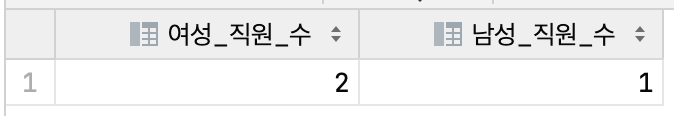
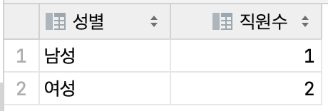
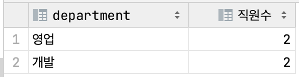

# 서브쿼리

서브쿼리는 하나의 쿼리 안에 또 다른 쿼리가 중첩된 형식으로 작성된 쿼리문이다.  
서브쿼리는 SELECT 문, FROM 문, WHERE 문의 총 세 위치에서 사용 가능하다.  
각 위치에 따라서 subquery가 수행하는 역할에 차이가 존재한다.

## SELECT 문에서 사용(스칼라 서브쿼리)

SELECT 문에서 서브쿼리를 사용하는 경우에는 스칼라 서브쿼리라고 부른다.  
주의할 점은 내부에서 중첩해서 사용하는 쿼리가 스칼라 값을 결과로 가져야 한다는 점, 즉 하나의 레코드만을 가져야 한다는 점이다.

스칼라 서브쿼리의 예시는 아래와 같다.  
각 성별에 해당하는 직원의 수를 구하는 서브쿼리문이다.

```sql
select (select count(*) from employee where gender = 0) 여성_직원_수,
       (select count(*) from employee where gender = 1) 남성_직원_수
```

쿼리의 결과는 다음과 같다.

하나의 record에 모든 데이터가 저장되어 있다.  
여성 적원 수, 남성 직원 수에 대한 집계가 각 열에 입력된 형태이다.

이와 유사한 결과를 group by 문을 통해 얻을 수도 있다.

```sql
select case
    when gender = 0 then '여성'
    when gender = 1 then '남성'
end as '성별', count(*) '직원 수'
from EMPLOYEE
group by gender;
```

해당 쿼리의 결과는 아래와 같다.

서브쿼리문의 결과와 차이점은 각 집계 결과가 서로 다른 record에 위치하게 된다는 점이다.  
`직원수`라는 동일한 열의 데이터이면서 서로 다른 레코드에 포함된다.

## FROM 절에서 사용(인라인 뷰)

다음으로 FROM 문에서 서브쿼리를 사용할 수 있다.  
FROM 문에서 서브쿼리를 사용하는 경우에는 `인라인 뷰`라고 부른다.

뷰는 특정 쿼리문을 저장하고 이름을 부여한 것으로써, 테이블처럼 뷰 이름을 사용해서 데이터를 조회할 수 있다.  
인라인 뷰는 따로 쿼리를 저장하는 대신 인라인에 직접 서브쿼리문을 제공하여 뷰와 동일한 역할을 하도록 한 것이다.

인라인 뷰 서브쿼리의 예시는 아래와 같다.  
인원수가 2명인 부서의 정보를 얻는 쿼리문이다.

```sql
select * from (
  select department, count(*) 직원수
  from employee
  group by department
) a where 직원수 = 2
```

각 부서의 직원수를 추출하는 서브 쿼리문을 FROM 문에 작성하여 인라인 뷰로 활용하고, 해당 뷰에 대해서 직원수로 WHERE 문을 걸어서 필터링하는 식으로 쿼리를 작성했다.  
쿼리 결과는 아래와 같다.


