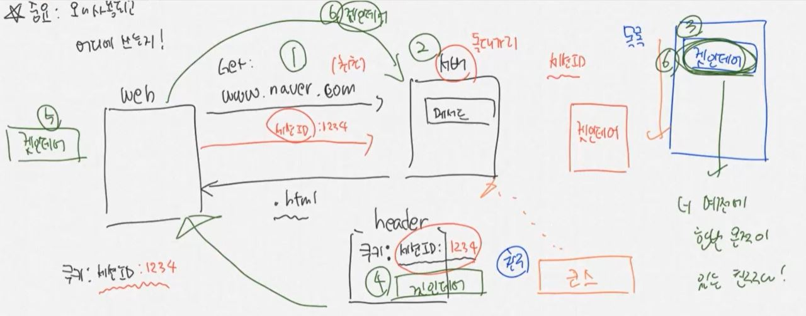
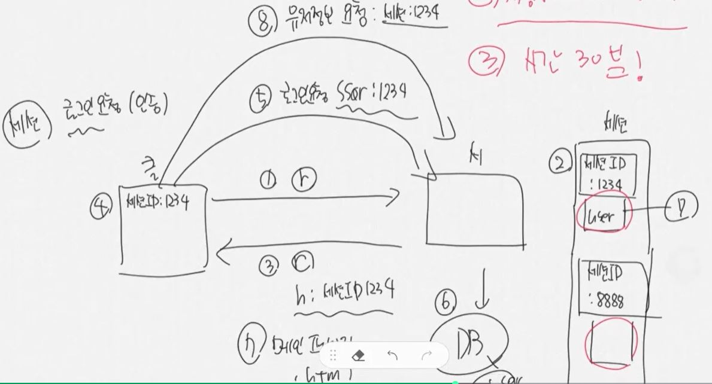
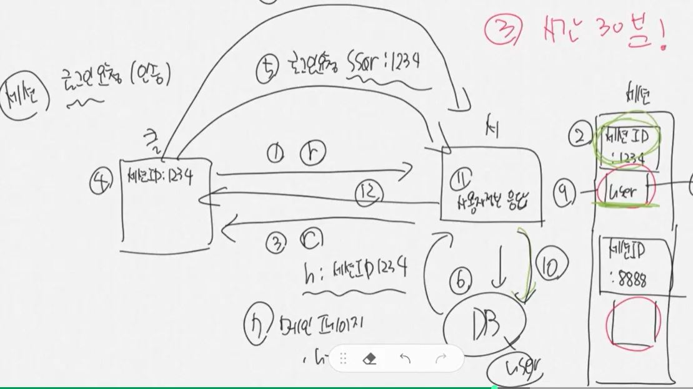
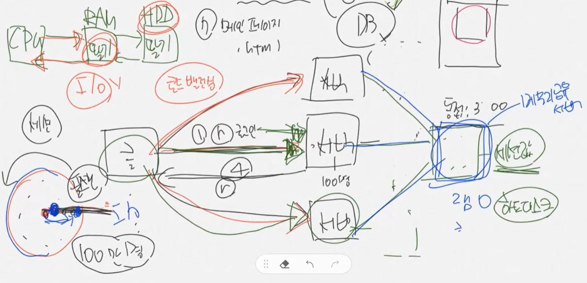

JWT = Json Web Token  
중요한 것 : 왜 사용되고 어디에 쓰는지

클라이언트가 웹에서 get 방식으로 요청하면, 서버에서는 컨트롤러에서 해당 url에 맞는 메서드를 찾고, 이에 맞는 html 파일을 return 해준다.  
이때 header에 쿠키를 달아서, 세션ID를 담아서 준다.  
웹브라우저는 이 세션 ID를 웹 브라우저의 쿠키 영역에 저장한다. 최초 요청시!

두번째 요청부터는 이 세션 ID를 헤더에 달고 요청을 보내게 된다.  
그러면 이제 서버는 세션 ID를 새로 생성하는게 아니라, 그대로 담아서 보내준다.

서버는 세션 ID를 만들어줄 때마다 목록을 만들어놔야 한다.  
이게 해당 사용자에게 발급해준 세션 ID임을 저장해야 하는 것이다.  
만약 다른 사용자가 위조된 세션 ID를 들고온다면 거부할 수 있어야 한다.  

세션 ID는 3가지의 경우에 사라진다.  
세션의 값을 서버 쪽에서 날리는 경우, 그리고 사용자가 브라우저를 종료시킨 경우이다.  
마지막은 특정 시간(보통 30분)이 지나서 삭제된 경우이다.  

세션을 인증하게 되면 세션 저장소에 세션ID가 저장되고, 관련된 정보를 저장할 수 있는 작은 공간이 생성된다.  
이 때 id, 비밀번호를 통해 로그인 요청을 하게 되면 그 사람의 user 정보를 세션에 딸려있는 공간에 저장한다.  
그 다음에 인증이 필요한 페이지를 요청하면, 서버는 그 사람의 세션이 있는지 확인하고, 거기에 딸려있는 정보로 DB에 요청을 해서 개인정보를 가져오는 등의 작업을 하게 된다.
세션을 통해 사용자를 인증할 수 있고, 민감한 정보에 접근할 수 있는지 여부를 결정할 수 있게 한다.  
  

하지만 세션에는 단점이 있다.  
클라이언트가 서버에서 요청을 할 때 어떤 정보를 응답해야 되는데, 사용자가 매우 많다고 해보자(300명)  
그런데 서버는 동접자를 100명 정도로 잡고 있었다면, 100명을 제외한 인원들은 대기를 해야 한다.  
이 때 대기를 안하도록 하려면 서버를 3개 만들고 운영해야 한다. load balancing. 부하를 분산시킨다.

사용자가 첫번째 요청시에 서버1에 요청을 해서 세션을 응답 받았다고 해보자.  
만약 서버1에 다시 요청을 하면 문제가 없을 것이다.  
하지만 서버2에 요청하는 순간, 서버는 이 사람을 처음 보는 사용자로 인식하게 된다.  
이걸 방지하기 위해 sticky server로 만들어서, 최초로 접속한 서버에 계속 요청이 보내지도록 제약을 둘 수 있다.
또는 세션을 복제해서 다른 서버에도 그 정보를 저장할 수 있다.

좋은 방법은, 이 서버들이 DB에 세션을 저장하고, 이를 공유해서 사용하는 것이다.  
그러나 원래 세션은 서버의 메모리에 접근해서 데이터를 가져오는 거라서, 속도가 매우 빠르다.  
그런데 이를 DB에서 가져오면 하드디스크에서 뒤져야 된다.  
하드디스크에서 데이터를 가져오게 되면 느려질 수 밖에 없다.

이로 인해 메모리 서버를 뒤지게 된다.  
모든 서버들이 이 메모리 서버를 뒤지게 되는데, 얘는 RAM만 있다, 하드디스크가 없고  
이런 서버가 대표적으로 Redis 서버가 있다.  

