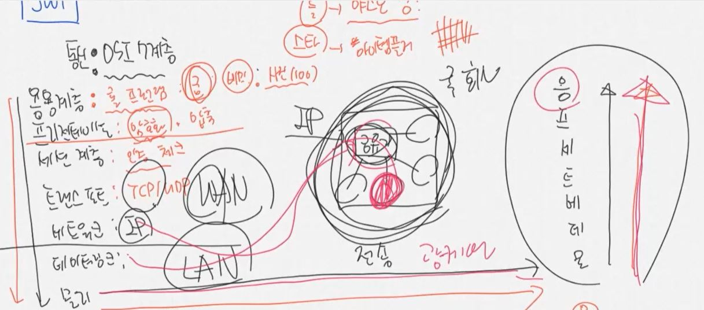
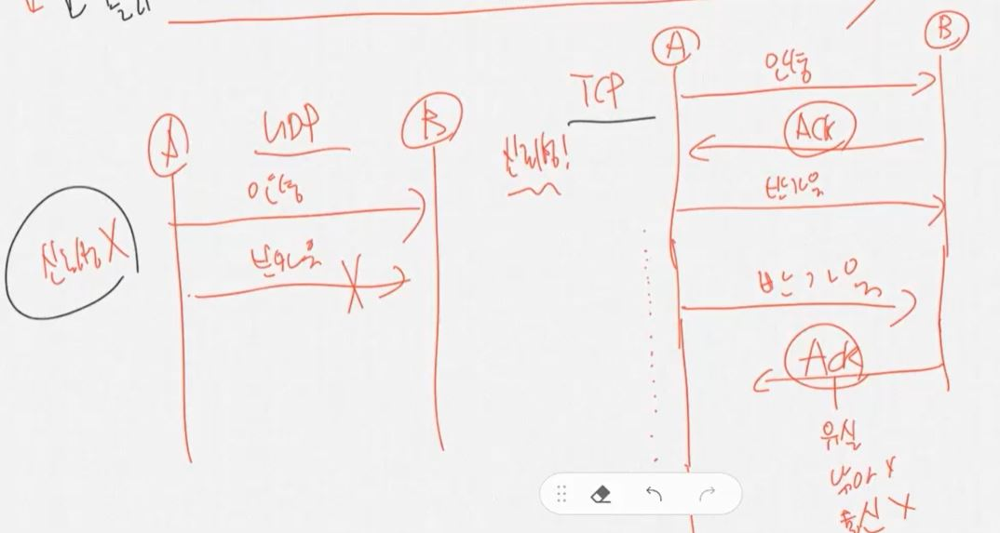
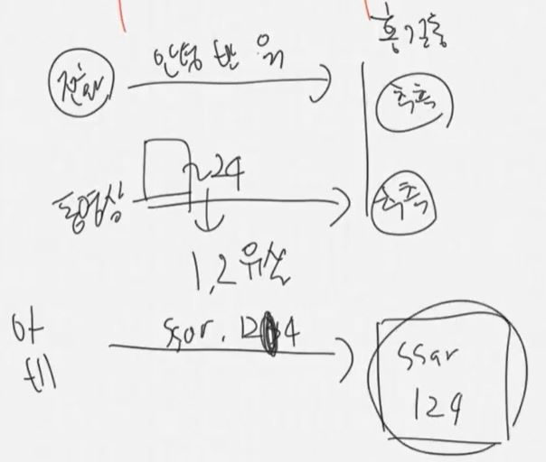
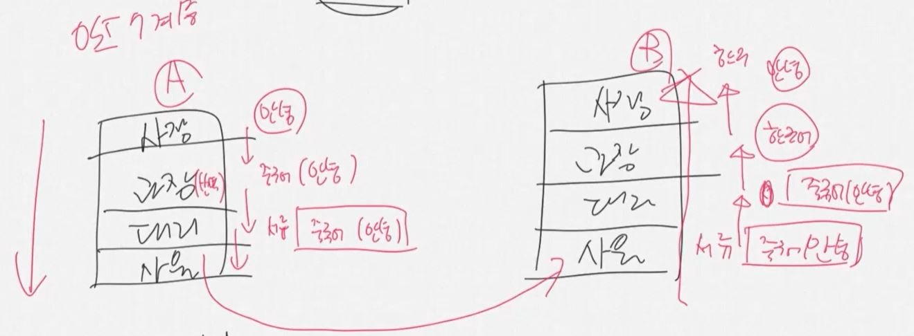

통신 OSI 7계층이라는게 있다.  
응용 - 프레젠테이션 - 세션 - 트랜스포트 - 네트워크 - 데이터링크 - 물리  
(물데네트세프응)  
응용계층에서 물리 계층으로 쭉 내려가서, 물리계층에서 실제로 데이터가 전송되고,  
상대방도 똑같이 물리계층에서 응용계층까지 올라가서 상대방이 읽을 수 있게 된다.

예를 들어 응용계층인 롤에서 궁을 쓰게 되면, 프레젠테이션 계층에서 이것을 암호화 및 압축한다.  
세션계층에서는 인증이 되었는지를 체크하는데, 상대방 컴퓨터가 켜져있는지, 거기에 내가 접근할 수 있는 사람인지를 체크한다.
그러면 트랜스포트 계층에서 TCP 통신을 할지 UDP 통신을 할지 결정한다.  
이러고 나서 네트워크 계층으로 가면 IP를 요청한다.  
데이터링크에서는 IP에 연결되어 있는 내부 통신에서 목적지를 찾는다.  
물리케이블, 예를 들어 광케이블에서는 드디어 데이터가 전달되어서,  
밑에서부터 올라가서 전달된다.  

TCP vs UDP  
TCP에서는 상대쪽에서 데이터를 보내오면, 이를 받았다는 신호로 Ack를 응답하게 된다.  
그런데 중간에 데이터가 유실되거나 다른 사람이 낚아 채거나 통신이 끊기면 Ack 응답이 오지 않게 된다.  
Ack 응답이 왔을 때에만 다른 데이터를 계속해서 보내게 된다.

이런 규칙이 있기 때문에 TCP는 신뢰성이 있는 통신이다.  
내가 보낸 데이터가 잘 도착했는지를 확인할 수 있다.  
하지만 UDP는 Ack 여부와 상관 없이 자기가 보내고 싶은 데이터를 계속 보낼 수 있다.  
따라서 신뢰성이 없는 통신 방식이다. 속도는 빠르더라도  

UDP 통신은 전화나 동영상 스트리밍에서 쓸 수 있다.  
통화 내용 중 말 한마디가 안 들리거나, 동영상 프레임중 몇개 정도는 유실되더라도 이해하고 추측할 수 있다.  
이와 같이 사람이 이해하는 것들은 UDP로 수행할 수 있다.

그러나 비밀번호나 아이디를 보내는게 중간에 끊겨서 보내지지 않는다면, 이는 정상적으로 진행이 된게 아니다. 반드시 TCP로 해야 한다!
이와 같이 웹이 이해하기 위해서는 TCP로 해야 한다.  

2개의 회사가 있다고 해보자.  
각 회사에 사장/과장/대리/사원이 있다.  
A 회사에서 B 회사로 문서를 전달할 때, 과장은 메시지를 번역하고, 대리는 서류함에 얘를 넣고, 사원에게 전달하도록 시킨다.
B 회사에서 이거를 받아서, 대리가 이 서류함을 풀고, 과장은 다시 한국어로 이를 번역하고, 사장님에게 이를 전달한다.
이런 방식으로 데이터가 전달된다고 이해하면 된다.

