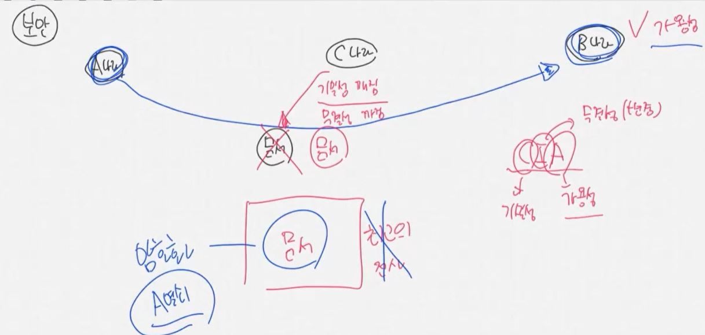
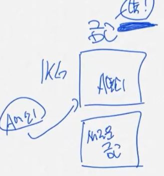
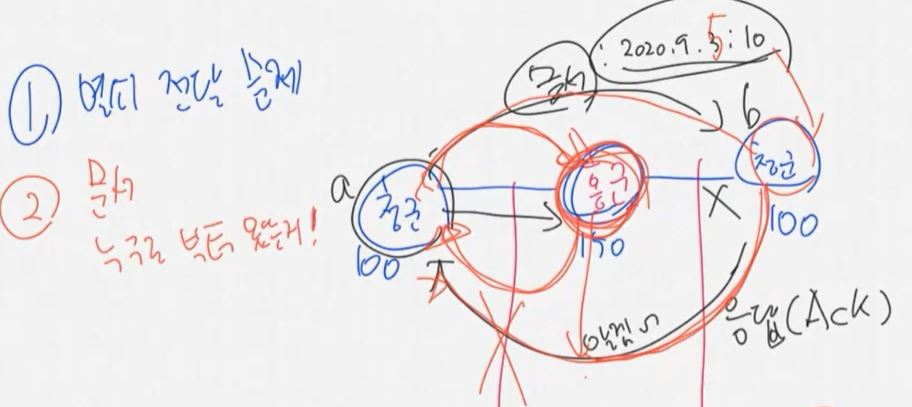

A, B, C 나라가 있다.  
여기서 A나라가 B나라에 문서를 전달할 때, 문서를 그냥 들고가면 C나라가 중간에 가로챌 수 있다. -> 기밀성 깨짐

- Confidential(기밀성, 보안 - 노출되면 안 됨)  
  또는 C나라가 중간에 문서를 조작해서 B나라에게 보낼 수 있다 -> 무결성 깨짐
- Integrity(무결성, 문서가 변경되면 안 됨)  
  이렇게 되면 결국 문서의 가용성이 깨진다.
- Availability(가용성, 원하는 문서에 접근 가능해야 함)  
  => 결국 문서를 그냥 전달하면 CIA가 타겟이 된다.  
  CIA를 유지하기 위해 노력해야 한다.

먼저 가용성을 유지하려면, 이 문서를 보낼 때 최고의 전사를 함께 보내서 문서를 지켜야 한다.  
그런데 C나라에도 최고의 전사들보다 강한 전사들이 있으면 지키지 못하게 된다.  
따라서 문서를 암호화할 필요가 있다.  
이렇게 되면 문서 자체의 기밀성이 유지되고, 가용성이 확보된다.  

또한 A열쇠가 있어야 열리는 금고가 있다고 생각해보자.  
그런데 이 금고 자체를 그냥 가져가 버리고 새로운 금고로 바꿔버리면, 무결성이 깨진다.  
따라서 이 금고를 절대 옮길 수 없게 벽에 붙여야 무결성을 유지할 수 있다.  
A열쇠를 가지고 붙어있는 금고에 접근할 수 있어야 무결성과 가용성이 확보된다.  

그런데 B나라에서 A라는 열쇠가 없어서 문서를 열어볼 수 없으면 가용성이 깨진다.  
따라서 결국 A나라가 B나라에게 열쇠를 전달해야 한다.  
이 열쇠도 중간에 털릴 위험이 있는 것이다. - 열쇠전달문제!

청군 사이에 홍군이 있다.  
왼쪽 청군이랑 홍군, 오른쪽 청군이랑 홍군이 싸우면 둘다 청군이 진다.  
결국 청군이 이기려면 양쪽에서 동시에 쳐들어가야 한다.  
그러기 위해서는 동시에 쳐들어가자는 문서를 왼쪽 청군이 오른쪽 청군에게 전달해야 한다.  
a청군이 2020.9.3 10시에 들어가자는 문서를 전달했을 때, b청군에게 받았다는 응답을 받아야 확신을 할 수 있다. - 응답(Ack)
응답이 오지 않는다면 그 시간에 쳐들어가면 안 된다.  
또한 응답이 왔더라도 그게 중간에 홍군이 가로채서 거짓으로 응답을 보낸 것일 가능성도 있다.  
또는 문서를 중간에 위조해서(9.5일로) b청군에게 보낼 수 있다.  
b청군의 응답(Ack)를 중간에 낚아챌 가능성도 있다.  
=> 따라서 이 문자가 누구로부터 왔는지를 알아야 한다.  

만약 문서가 열쇠로 암호화되어있으면, 중간에 홍군이 문서를 낚아채도 문서를 위조할 수는 없다.  
그러나 홍군이 낚아채고 새로운 문서를 만들어서 보낼수는 있다.  
이 문제를 해결하기 위해서는 문서가 어디에서 왔는지를 알아야 한다.
