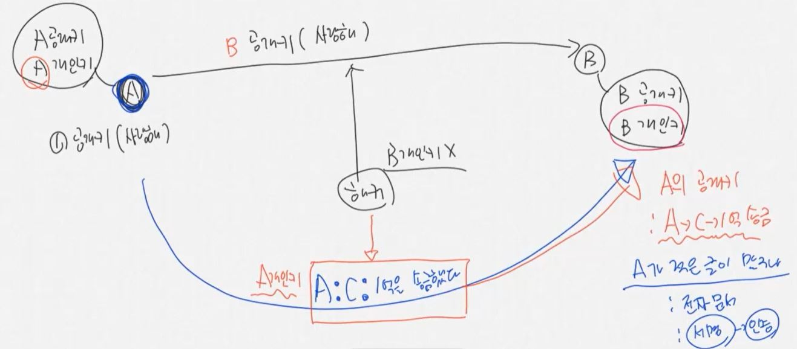
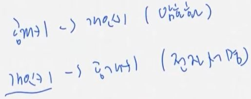
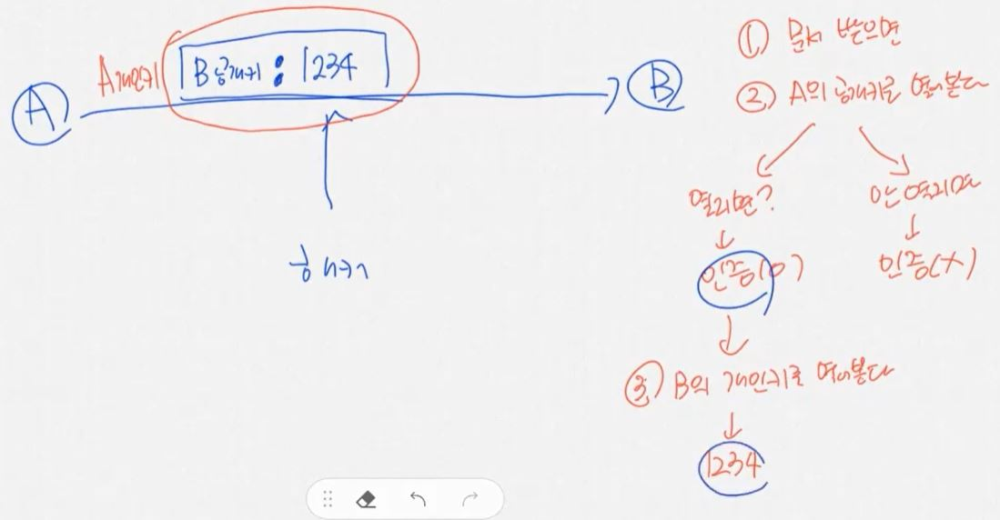

2가지의 문제가 있었다.

1. 열쇠 전달 문제
2. 넌 누구야? 인증 문제

RSA(암호화)에는 2가지의 키가 있다.

- public key : 공개키
- private key : 개인키  
  만약 키 하나로 잠그고 여는 걸 같이하면 symmentric key, 대칭키라고 한다.
  그러나 여기서는 공개키로 잠그고, 개인키로 열게 된다.  
  A, B는 각각 자신의 공개키, 개인키를 가지고 있고, 공개키는 누구나 접근할 수 있다.
  A가 B에게 사랑해라는 메시지를 보낼 때, A는 먼저 공개키로 사랑해를 암호화한다.
  이 때 B가 만든 B 공개키로 암호화한다.  
  이렇게 하면 해커는 B 개인키를 가지고 있지 않기 때문에 문서를 낚아채도 그 내용을 읽어볼 수 없다.
  이렇게 하면 키 전달 문제를 쉽게 해결할 수 있다 - 키는 애초에 공개되어 있기 때문에!
  B는 자신의 개인키로 받은 메시지를 열어볼 수 있다.

B가 A에게 문서를 보낼 때도 마찬가지이다.  
A의 공개키로 문서를 암호화해서 보내고, A는 자신의 개인키로 문서를 열어서 보게 된다.

이번엔 A가 B에게 'A가 C에게 1억을 송급했다'는 메시지를 보내고 싶다고 해보자.
이거를 A의 개인키로 암호화해서 전달하자.  
해커가 이거를 중간에 낚아채면 A의 공개키를 이용해서 이거를 열어볼 수 있다.
그러나 이건 중요치 않은게, 이 메시지는 A가 보냈다는게 명확히 드러나기 때문이다.
B가 이 문서를 받고 A의 공개키로 열어보면 이 문서가 A로부터 왔다는 것을 알 수 있다.
A의 공개키로 열어볼 수 있다는 것은 이것이 A의 개인키로 잠겼다는 것이고, 이는 A가 적은 것이 맞다는 것을 의미한다
=> 전자문서의 서명으로 쓰인다. 인증 방식이다.  

공개키로 잠그면 개인키로 열어볼 수 있고, 개인키로 잠그면 공개키로 열어볼 수 있다.
이 때 전자는 암호화이고, 후자는 전자서명이다.  

A가 B에게 비밀번호를 보내는데, B의 공개키로 암호화한다고 하자.
그런데 해커가 이를 낚아채서 새로운 데이터를 B에게 보낼 수 있다.
따라서 이를 A의 개인키로 한 번 더 잠글 수 있다.  
그러면 이제 B는 문서를 받으면 A의 공개키로 열어보고, 열리면 인증이 해결된 것이다.
만약 열리지 않는다면 인증이 된 것이 아니고, 다른 사람이 위조한 것이기 때문에 열어볼 가치가 없게 된다.
만약 열리면 B의 개인키를 이용해서 열어서 비밀번호를 얻을 수 있다.
=> 이렇게 되면 인증과 암호화를 동시에 할 수 있다!  

