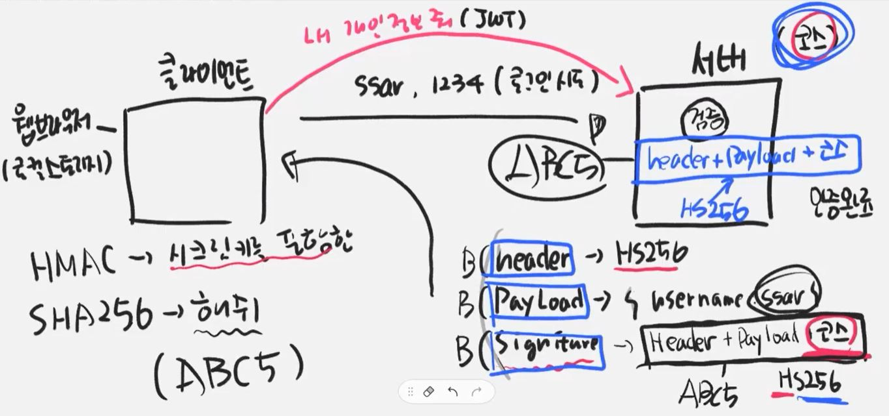
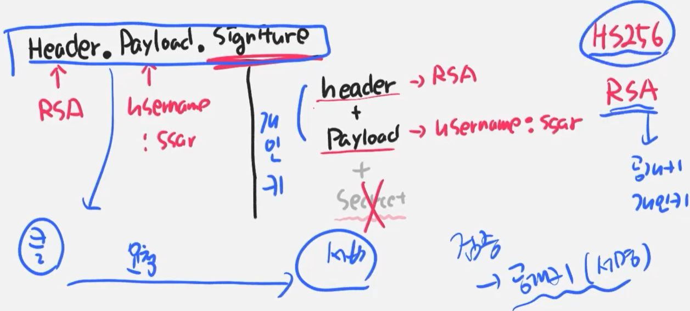
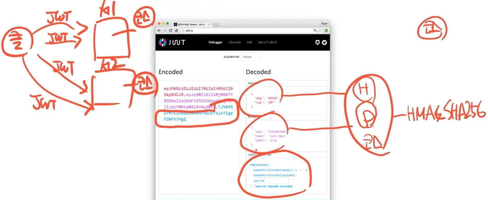

JWT란 정보를 JSON 객체로 안전하게 전송하기 위한 것  
이 정보는 디지털 서명이 되어있으므로 신뢰할 수 있으며, HMAC or RSA 방식으로 공개/개인 키 쌍을 사용하여 서명할 수 있다

JWT의 핵심은 서명된 토큰이다.  
이 토큰이 내가 만든게 맞음을 확인하는 서명의 용도로 쓰는 것  
서명된 토큰은 클레임(포함된 정보)의 무결성을 확인할 수 있게 한다.

JWT의 구조 - xxxxx.yyyyy.zzzzz  
x를 헤더(Headeer), y를 Payload, z를 서명(Signature)이라고 한다.

헤더에는 어떤 알고리즘을 사용해서 서명했는지, 토큰의 타입이 뭔지 등을 적는다.  
json은 base64url로 인코딩 되어있는데, base64url은 암호화/복호화가 가능한 인코딩이다.

ex) 스프링에서 비밀번호를 암호화하면, 얘는 해싱이 되기 때문에 복호화할 수는 없다. 따라서 암호를 찾을 수 없고, 그냥 암호를 초기화해야 한다.

이와 달리, Base64는 디코딩이 가능하다.

```
{
	"alg": "HS256",
    "typ": "JWT"
}
```

Payload는 정보, Claim을 담고 있다.  
이 클레임에는 등록된 클레임과 개인클레임으로 이루어진다.  
등록된 클레임은 필수는 아니지만 권장되는, 미리 정의된 클레임 집합이다.  
(iss(발행자), exp(만료시간), sub(주제), aud(청중))

중요한 건 개인 클레임인데, 이 개인 클레임에 user id 같은 것을 넣게 된다.  
그래서 JWT에 유저 정보에 필요한, 공개되어있지만 그 유저인지를 특정할 수 있는 primary key를 넣게 된다.

```
{
	"sub": "1234567890",
    "name": "John Doe",
    "admin": true
}
```

마지막으로 서명 부분에는 헤더와 페이로드 정보, 나만 알고 있는 개인키를 HMAC으로 암호화해서 넣는다.

```
HMACSHA256(
	base64UrlEncode(header) + "." +
    base64UrlEncode(payload),
    secret)
```

서버와 클라이언트가 있다.  
클라이언트에서 id ssar, pw 1234로 로그인을 시도했을 때,  
서버가 이제는 세션이 아닌 JWT를 만들어야 한다.

header, payload, signature를 만들어야 한다.  
header에는 HS256으로 서명을 했다는 정보를 넣고,  
payload에는 {username:ssar}로 만들 것이다.  
signature는 [Header + Payload + key값(코스라고 하자)]을 HS256으로 암호화한다.  
HS256은 HMAC이라는 방식으로 SHA256으로 암호화하는 것이다.  
SHA256은 쉽게 말해서 해쉬를 의미한다.(복호화할 수 없는 키값을 만듦)  
HMAC이란 것은 시크릿 키를 포함한 암호화 방식이다.

이렇게 작성한 뒤, header, payload, signature 각각을 Base64로 인코딩한다.  
그러고 나서 이것을 클라이언트에 돌려준다. - 이상한 난수처럼 보일 것

클라이언트는 이것을 들고 있게 된다.  
웹브라우저에는 로컬스토리지라는 저장소가 있는데, 이런데에 저장하게 된다.  
저장을 해두었다가 클라이언트가 자신의 개인정보를 달라는 등의 요청을 보내면, 이 때 JWT를 같이 실어서 보낸다.

서버가 이 JWT를 받으면, 이것이 신뢰할 수 있는 토큰인지를 검증해야 한다.  
이 signature에 넘어온 정보(ABC5라고 하자)를 검증해야 하는 것이다.  
서버에서는 유효한 토큰인지를 확인하기 위해 [header + payload + 코스]를 똑같이 HS256으로 암호화하고, 이 값이 ABC5와 같은지를 확인하게 된다.
이를 통해 인증을 할 수 있다.  
payload에 user 정보가 들어있으므로, 이를 이용해서 DB에서 회원 정보를 조회하면 된다.  


JWT는 Header.Payload.Signature로 되어있었는데, Signature는 [header+payload+secret]을 HS256으로 암호화한 것이었다.  
만약 이걸 HS256이 아닌 RSA를 사용하게 되면, 헤더에 RSA라고 적어주고 payload에 username:ssar를 적고,  
signiture를 만들 때 [header+payload]만 암호화한다.  
RSA에서는 공개키와 개인키가 있어서, 서버가 자신의 개인키로 header와 payload를 잠그면 된다.  
그러면 이 토큰을 클라이언트에서 받아서 다시 요청할 때, 서버는 검증시에 공개키로 저걸 열어보기만 하면 된다.  
공개키로 서명을 검증하면 된다!  


HS256, RSA 둘다 사용 가능하지만, 보통은 HS256을 많이 사용한다.

JWT에서 header, claim, signature는 셋 다 base64로 암호화되어 있다.  
이건 base64를 이용하면 누구나 풀 수 있다.  
이는 암호화에 목적이 있는 것이 아니라, 서명에 목적이 있는 것이다.  
데이터가 유효한지, 무결성을 검증하기 위한 목적일 뿐이다.  
따라서 이걸 디버그해서 풀어보면 정보가 나오게 된다.

클라이언트에서 보낸 이러한 난수를 디코드해서 풀고, 자신이 가진 키와 함께 HMAC SHA256으로 암호화하고, 이것이 뒤에 붙은 시그니처와 동일한지 확인하면 인증이 되는 것이다.  
이렇게 하면 세션이 아니라 토큰 검증을 사용하는 것이라서, 다른 서버에 요청을 넣어도 상관이 없어진다.  

