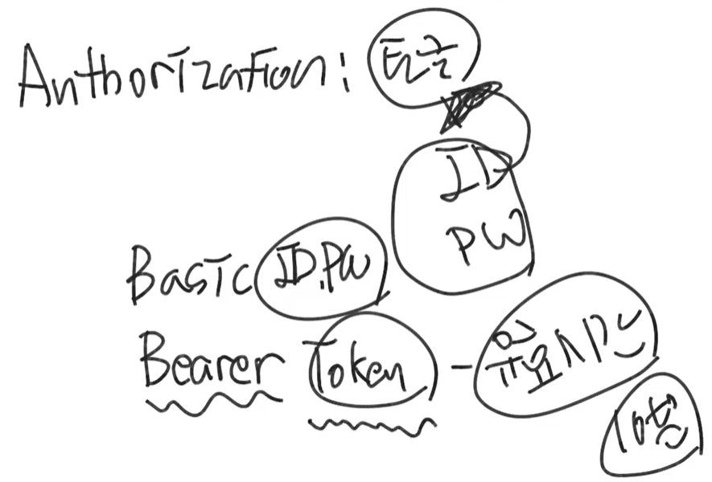

클라이언트가 ID, PW를 이용하여 최초 요청을 하면, 세션ID를 생성하고 서버의 세션 저장소에 정보를 저장한다.  
그리고 세션 ID를 서버에서 클라이언트로 돌려준다.  
이때 클라이언트가 웹브라우저이면 프로그램 쿠키영역에 세션ID를 저장한다.  
그리고 그 다음부터 새로운 요청이 일어나면 이 ID를 들고 요청한다.  
  
이 방식은 서버가 여러개면 안 좋다. 서버마다 세션용 메모리가 따로 있기 때문이다.

또한 Ajax 같은 걸 쓰면 클라이언트가 자바스크립트로 요청을 보내게 되는데,  
자바스크립트로 요청을 하면, 쿠키는 동일 도메인에서의 요청에 대해서만 발동한다.  
예를 들어 A가 최초로 요청을 할 때, 210.10.10.5와 같은 ip에서 naver로 요청하는 식이 될 텐데, 이 상황에서는 쿠키가 날라가지 않는다.  
따라서 자바스크립트가 요청을 할 때 강제로 쿠키를 담아서 요청할 수 있는데, 요즘 서버에서 쿠키는 http only라고 설정해서 자바스크립트 같은 곳에서는 쿠키를 던질 수 없게 해놓는다.
웹브라우저에서 정상적으로 요청을 보낸다면 괜찮지만, 자바스크립트 파일에서 fetch("naver.com", {headers:{Cookie:""}}).then (); 식으로 요청이 오면 다 거부한다.
  
여기서 http only를 false로 하면 요청이 오긴 하지만, 이 선택은 보안적으로 좋지 않다.  
또한 이러한 쿠키 방식을 쓰면 서버가 많아질수록 관리하는데 확장성이 떨어진다.

결국 header에 Authorization이라는 쿠키 값에 인증 정보(ID, PW)를 넣는 방식을 사용하곤 하는데, 이것이 http basic 방식이다.  
이렇게 요청을 하면 매번 ID랑 PW를 달고 요청한다.  
그러면 쿠키와 세션을 사용할 필요가 없어져서 확장성은 올라가지만, 이 ID, PW가 암호화가 안 되기 때문에 중간에 노출이 될 수 있다.  
이걸 노출이 안 되게 하려면 https(secure) 서버를 사용하면 된다.  
그러면 ID, PW가 암호화되어 날아간다.  

하지만 jwt 방식에서는 이 Authorization에 토큰을 넣을 것이다.  
이것 또한 노출이 되지 않는게 좋지만, 이 토큰 자체가 ID, PW를 직접적으로 담고 있지는 않고, 또한 토큰은 로그인 할 때마다 서버에서 새로 만들어 주기 때문에 위험 부담이 적다.

HTTP Basic -> ID, PW를 담고 요청  
: 노출되면 계속 사용 가능  
HTTP Bearer -> Token을 담고 요청  
: 유효시간이 존재해서 노출되도 일정시간 밖에 사용 못 함  
  

